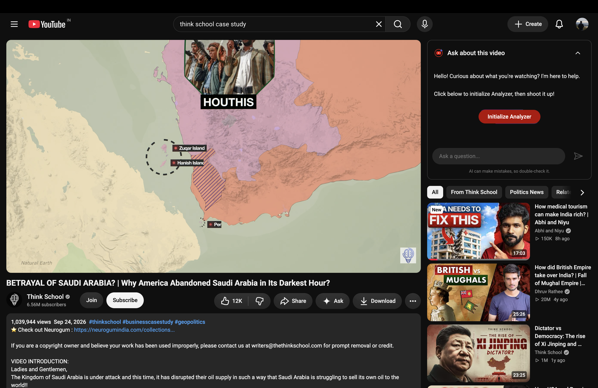
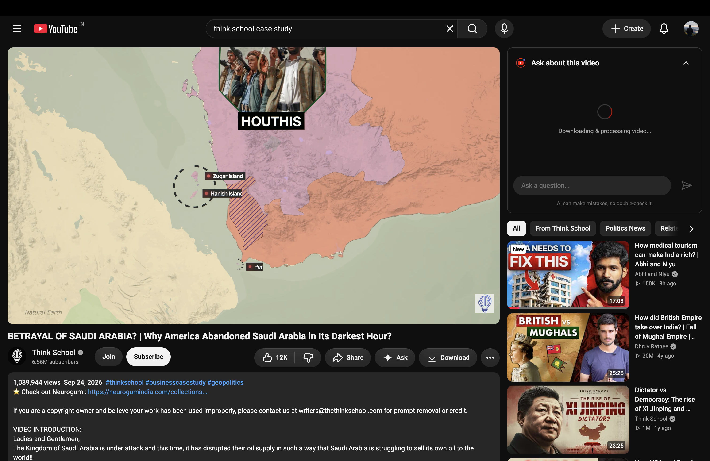
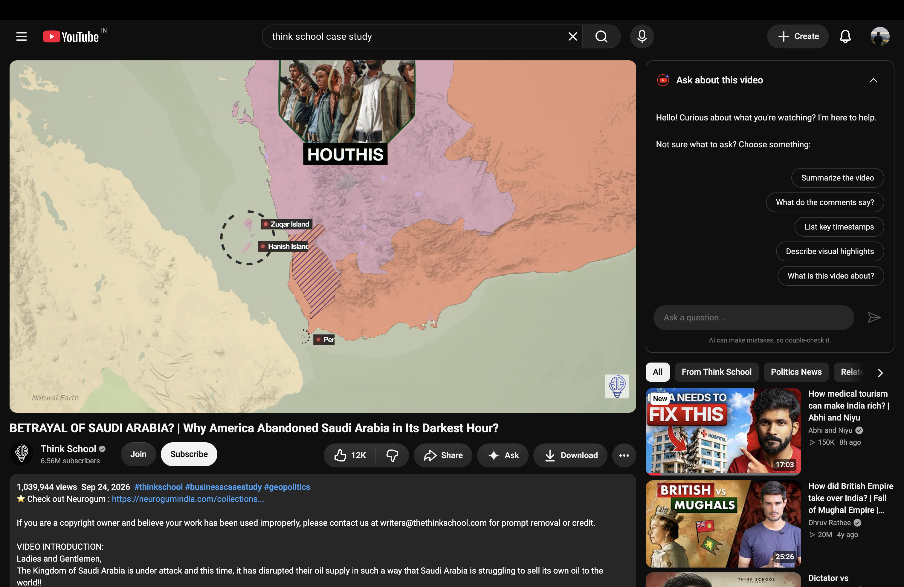
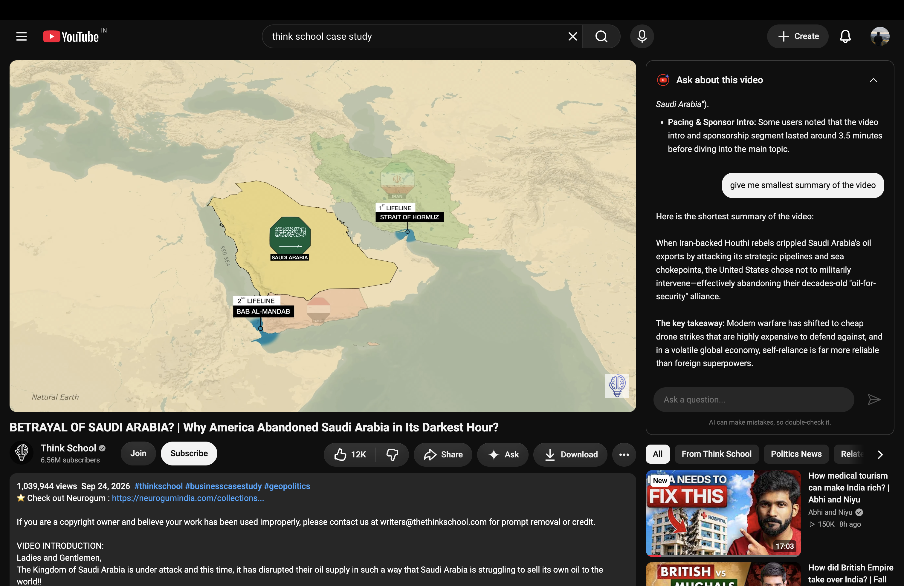
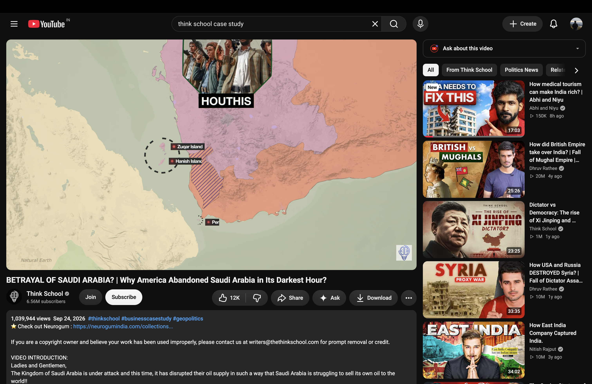

# YouTube Analyzer

YouTube Analyzer is a Chrome Extension that works with YouTube to provide you with small summary of the video and resolve your queries related to it in just a click.
YouTube Analyzer can be used as a daily tool that can boost your YouTube Experience.

**Project Demo Link:** https://youtu.be/tQ9NwhwwHBE
<br>

## Benefits of YouTube Analyzer

- **Time Efficiency :** Save valuable time by quickly accessing summarized insights of YouTube videos, allowing users to efficiently consume content without spending hours watching lengthy videos.

- **Comprehensive Understanding :**  Gain a comprehensive understanding of video narratives and audience reactions through automatic analysis of video content and sentiment analysis of comments, providing deeper insights beyond surface-level viewing.


- **Efficient Content Consumption :**  Enable users to efficiently consume YouTube content by providing concise summaries of videos, reducing the time required to grasp the key points.

<br>

## Tech Stack

YouTube Analyzer is smooth, sharp looking, and multi-fuctioning modern day extension built to operate with ease. YouTube Analyzer can work on multiple devices as well i.e. you can operate it with any device you have and that even without any bug and glitch.
Followinng technologies are used to built Tumin:

- **Python :** The backbone for managing server-side operations, handling requests, and integrating the Gemini API. Its versatility allows smooth communication between the frontend extension and backend.

- **Google Gemini API :** The core AI engine! The extension uses the natively multimodal `gemini-3.8-flash` model. By using the Gemini File API, the model directly processes both the raw video file and the YouTube transcript simultaneously, enabling it to answer extremely specific questions about both spoken content and the visuals on-screen.

- **Flask :** A lightweight web framework used to build the backend REST API that bridges the Chrome extension to the Gemini model.

- **yt-dlp :** Used in the backend to rapidly download the YouTube video so it can be uploaded and analyzed by Gemini.

- **HTML/CSS/JavaScript :** The foundation of the extension's frontend, providing a native, sleek YouTube-like interface with dynamic interactions and clickable timestamps.

<br>

## Snapshots of YouTube Analyzer:

### Landing Window


### Loading Screen (Video Analysis in Progress)


### Analyzed Content Loaded


### Asking Visual Questions


### Minimized Tab


## Install Dependencies

```bash
pip install -r requirements.txt
```

# Thanks💖
